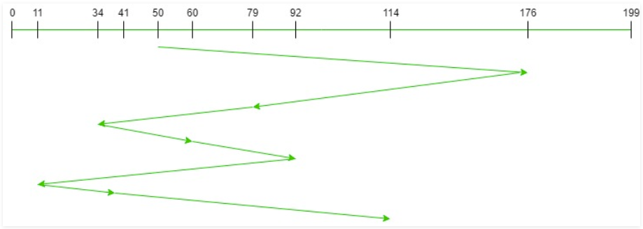
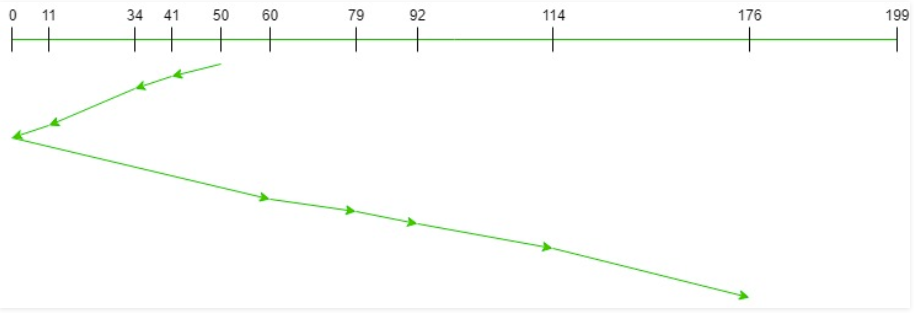
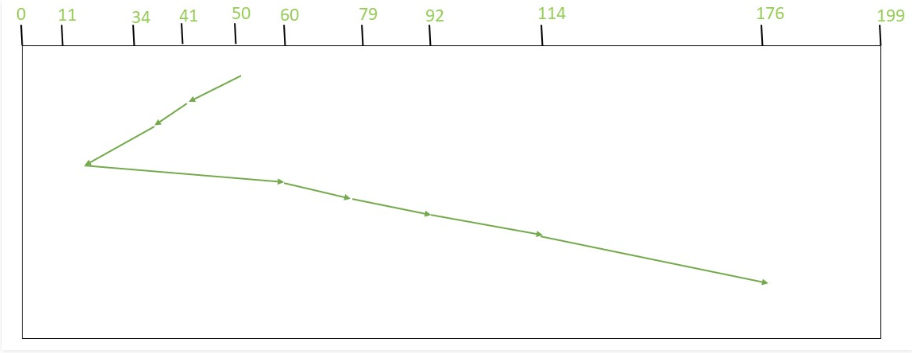

# Disk Scheduling Algorithms
  

### FCFS - First Come First Serve Algorithm
The algorithm works using the same logic of First In First Out (FIFO) in the queue algorithms in data structure tools.



### SCAN - Elevator Algorithm
The head starts from the current cylinder being serviced in the direction it was going until the end and then it is reversed from 0 to the end of the values of cylinders to be serviced.



### SSTF - Shortest Seek Time First Algorithm
The values that are closer to the head position should be serviced first in order to minimize the seek operations.



## References
* [First Come First Serve](https://www.geeksforgeeks.org/fcfs-disk-scheduling-algorithms/)
* [SCAN (Elevator)](https://www.geeksforgeeks.org/scan-elevator-disk-scheduling-algorithms/)
* [Shortest Seek Time First](https://www.javatpoint.com/os-sstf-scheduling-algorithm/)

## Tools
* [Java](https://www.oracle.com/technetwork/java/javase/downloads/index.html)
  
  Version used on this project
  ```
  C:\Users\user>java --version
  java 11.0.5 2019-10-15 LTS
  Java(TM) SE Runtime Environment 18.9 (build 11.0.5+10-LTS)
  Java HotSpot(TM) 64-Bit Server VM 18.9 (build 11.0.5+10-LTS, mixed mode)
  ```
  
## License


```
MIT License

Copyright (c) 2019 Abdul Khaliq

Permission is hereby granted, free of charge, to any person obtaining a copy
of this software and associated documentation files (the "Software"), to deal
in the Software without restriction, including without limitation the rights
to use, copy, modify, merge, publish, distribute, sublicense, and/or sell
copies of the Software, and to permit persons to whom the Software is
furnished to do so, subject to the following conditions:

The above copyright notice and this permission notice shall be included in all
copies or substantial portions of the Software.

THE SOFTWARE IS PROVIDED "AS IS", WITHOUT WARRANTY OF ANY KIND, EXPRESS OR
IMPLIED, INCLUDING BUT NOT LIMITED TO THE WARRANTIES OF MERCHANTABILITY,
FITNESS FOR A PARTICULAR PURPOSE AND NONINFRINGEMENT. IN NO EVENT SHALL THE
AUTHORS OR COPYRIGHT HOLDERS BE LIABLE FOR ANY CLAIM, DAMAGES OR OTHER
LIABILITY, WHETHER IN AN ACTION OF CONTRACT, TORT OR OTHERWISE, ARISING FROM,
OUT OF OR IN CONNECTION WITH THE SOFTWARE OR THE USE OR OTHER DEALINGS IN THE
SOFTWARE.
```
## Acknowledgments
* Screenshots from: [GeeksforGeeks](https://www.geeksforgeeks.org/disk-scheduling-algorithms/)
